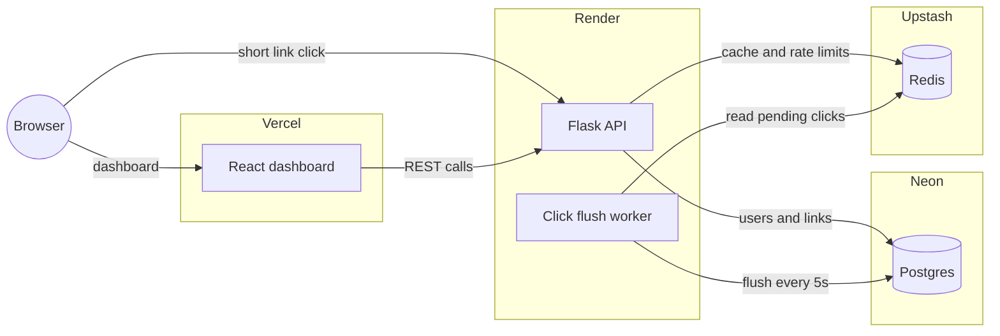

# URL Shortener

Flask API and a small React dashboard. Track B spec, shorten, redirect, stats, delete, with collision handling, expiry, rate limiting, caching, and auth.

## Stack

- Backend, Flask, Postgres, Redis, JWT and API key auth
- Frontend, React, Vite and Tailwind
- Rate limiting, short code generation, and click counting are hand rolled, no flask-limiter or shortuuid

## Deployed

- Frontend, https://url-shortner-bay-phi.vercel.app
- Backend, https://urlshortner-2u1f.onrender.com
- Test account, test@gmail.com, password 12345678

Backend is on Render free tier, sleeps after 15 min idle, first request after that can take 40 to 50 seconds.

## Running it locally

```bash
cd backend
python -m venv venv && venv\Scripts\activate
pip install -r requirements.txt
copy .env.example .env       # DB_URL, SECRET_KEY, REDIS_URL
python run.py                # localhost:5000
```

```bash
cd frontend
npm install
copy .env.example .env       # VITE_API_BASE_URL if backend isn't on :5000
npm run dev                  # localhost:5173
```

## API

| Method | Path | Auth | Notes |
|---|---|---|---|
| POST | `/auth/signup` | none | returns a JWT |
| POST | `/auth/login` | none | returns a JWT |
| POST | `/auth/api-key` | JWT | generates or rotates an API key, shown once |
| POST | `/shorten` | JWT | rate limited per IP |
| GET | `/my-links` | JWT | all links owned by the current user |
| GET | `/<code>` | none | 302 redirect, 404 if missing, 410 if expired |
| GET | `/stats/<code>` | none | click count, created_at |
| DELETE | `/<code>` | JWT or API key | must own the link |
| GET | `/analytics` | none | top 5 by clicks |

`POST /shorten` example.
```json
{ "url": "https://example.com/some/long/path", "alias": "myco", "expires_in_minutes": 60 }
```
```json
{ "short_code": "myco", "short_url": "https://urlshortner-2u1f.onrender.com/myco", "created_at": "..." }
```
`alias` and `expires_in_minutes` are optional.

## A few things worth asking about

- Short codes are `sha256(url + id)` in base62, not `base62(id)` directly, so codes are not sequential and not guessable. Collisions retry with a fresh Postgres sequence id.
- `/<code>` is cached in Redis with a TTL capped by the link's own expiry, plus negative caching so bogus codes do not keep hitting Postgres.
- Click counts go through Redis `INCR` and get flushed to Postgres every 5 seconds by a background worker, instead of a DB write per redirect.
- Rate limiting is Redis `INCR` and `EXPIRE`, fixed window, chosen over a sliding window for simplicity. There is a known tradeoff, up to 2x burst can happen right at the window boundary.
- `/analytics` queries Postgres directly instead of a Redis leaderboard. Considered `ZINCRBY`, dropped it since keeping it in sync on delete was the harder part, not the read speed.
- `DELETE` accepts either a JWT or an API key, so the dashboard and scripts both work without extra hoops.
- Redirect is 302, not 301, so the server still sees every click instead of the browser caching it away.

## Not done

- No automated tests, tested by hand against a live server
- No phishing or malware blocklist
- Assumes a single backend instance. Running multiple is safe, just does some duplicate flush work

## Architecture

Frontend and backend are separate deployments. Backend reads and writes Postgres directly and uses Redis for caching, rate limits, and click counters. A background worker inside the backend flushes pending click counts from Redis to Postgres every few seconds.


